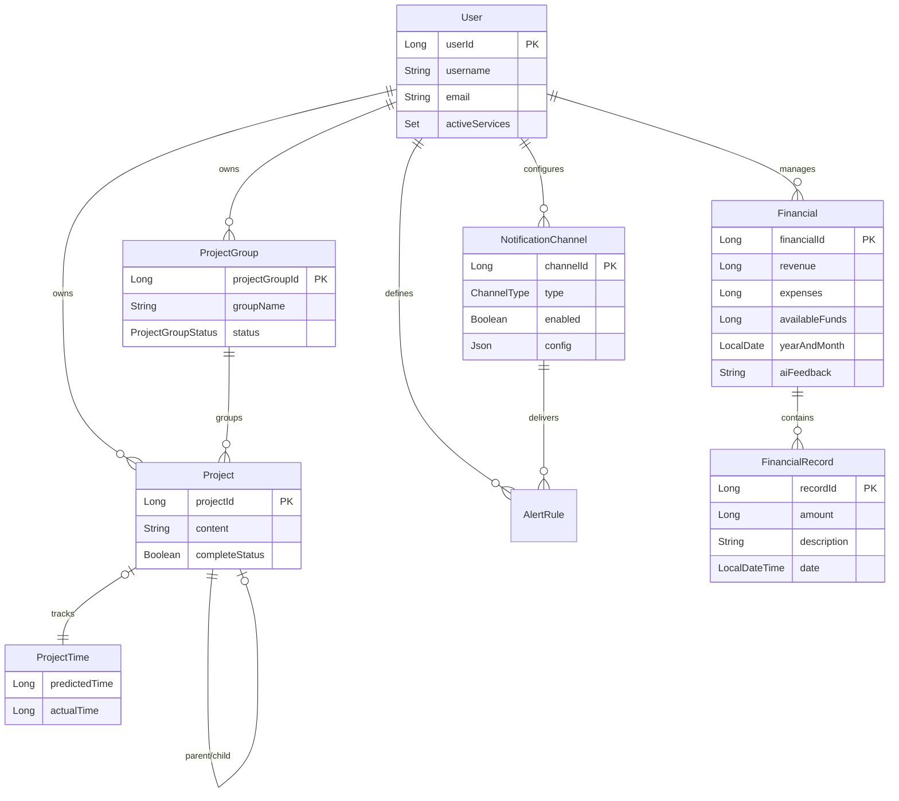

# Personal Life App (KoulLife)

## 🎯 프로젝트 목표
**"나의 삶을 체계적으로 관리하고, AI 기반의 피드백을 통해 성장하는 라이프 매니지먼트 플랫폼"**

단수히 기록만 하는 것이 아니라, 축적된 데이터를 바탕으로 **AI**가 분석한 재정 및 프로젝트 피드백을 제공하여 사용자의 의사결정을 돕고 생산성을 극대화하는 것을 목표로 합니다.

---

## ✨ 프로젝트 주요 기능

### 1. 💰 재정 관리 (Financial Management)
- **월별 재정 현황 추적**: 수입(Revenue), 지출(Expenses), 가용 자금(Available Funds)을 월 단위로 관리합니다.
- **AI 재정 피드백**: 매월 재정 데이터를 기반으로 AI가 소비 습관을 분석하고 개선점을 제안합니다.
- **거래 내역 기록**: 상세한 수입/지출 내역을 기록하여 자금 흐름을 투명하게 파악합니다.

### 2. 🚀 프로젝트 관리 (Project Management)
- **계층형 프로젝트 구조**: 프로젝트를 상위/하위 개념으로 연결하여 체계적으로 관리합니다. (이전/다음 프로젝트 연결)
- **프로젝트 그룹**: 연관된 프로젝트들을 그룹핑하여 통합 관리하고, 진행 상태(진행 중, 완료 등)를 추적합니다.
- **시간 관리**: 각 프로젝트의 예측 소요 시간과 실제 소요 시간을 기록하여 시간 관리 효율성을 분석합니다.

### 3. 🔔 알림 시스템 (Notification System)
- **다중 채널 지원**: **Slack**, **Telegram**, **Email** 등 사용자가 선호하는 채널로 알림을 받을 수 있습니다.
- **유연한 설정**: 각 채널별로 활성화/비활성화 여부를 설정할 수 있으며, 서비스별(재정, 프로젝트 등) 알림 규칙을 커스터마이징할 수 있습니다.
- **이벤트 기반 알림**: AI 피드백 생성, 프로젝트 마감 등 주요 이벤트 발생 시 즉시 알림을 발송합니다.

### 4. 👤 사용자 및 서비스 관리
- **보안 인증**: JWT 기반의 안전한 로그인 및 회원가입 환경을 제공합니다.
- **맞춤형 서비스**: 사용자가 원하는 서비스(재정, 프로젝트 등)만 선택하여 활성화할 수 있는 모듈형 구조를 갖추고 있습니다.

---

## 🗂 ERD (Entity Relationship Diagram)

주요 도메인 엔티티들의 관계는 다음과 같습니다.

---

## 🛠 사용 기술 (Tech Stack)

### Backend
- **Java 21**
- **Spring Boot 3.5.9**
- **Spring Data JPA**
- **Spring Security & JWT**
- **Spring AI (Google GenAI)**
- **Spring Batch**

### Database & Infrastructure
- **PostgreSQL**
- **Docker & Docker Compose**

### Tools & Libraries
- **Gradle**
- **Lombok**
- **Password4j**
- **JavaMailSender**